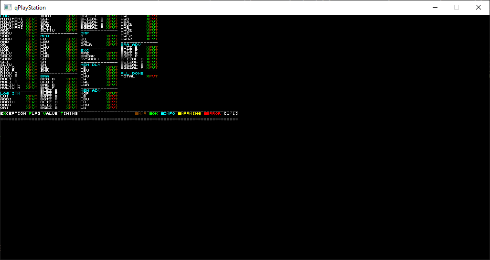
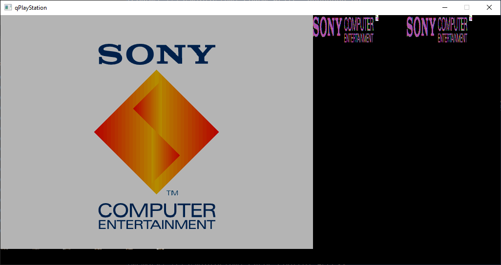

# qPlayStation
A PlayStation 1 emulator that you probably shouldn't use, made with C++ and SDL
## Features
Still very work-in-progress. No games are playable, and there's no sound emulation.  
Can run the PS1 bootup animation as well as some ROM-based test utilities.  
Passes most of AmiDog's CPU tests, as shown in the screenshots.  
Uses the GTE system from [mednafen](https://github.com/libretro-mirrors/mednafen-git)
## Building
Currently, there is only build support for Windows.
- Install Microsoft Visual Studio Community 2019.
- Open `qPlayStation.sln` and build.
## Usage
Run qPlayStation.exe from command line, with the BIOS ROM as argument 1 and the PSX-EXE file as argument 2.  
e.g. `qPlayStation.exe SCPH1002.bin psxtest_cpu.exe`
## Screenshots

## Future Plans
- Sound support
- CD-ROM emulation
- Custom GTE